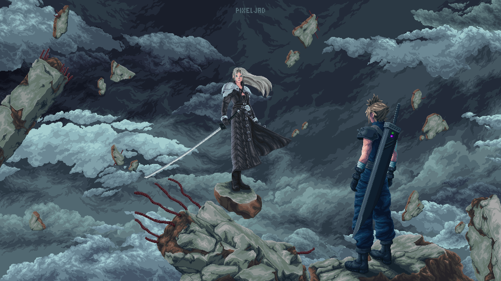

  

<h1 align="center"> Yooo, I'm Den 👾</h1>

<h4 align="center">📚Engineering student @PoliMi📚</h4>

 
    
    

### 🌟 About Me

<h4> 
  
 
  👨🏻‍💻 Currently undergoing the 3rd year of studies in CS engineering @Polimi  
  

</h4>

### 🧰 Languages and Tools

 

###

#

### 📊 Statistics

